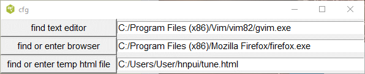
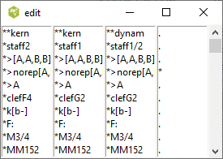
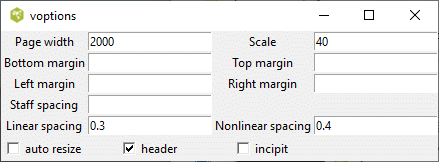

## Interface to Humdrum Notation Plugin (Hnp)

###  Introduction

Documentation to this plugin can be found <https://plugin.humdrum.org/>. As
described in the document, the Humdrum Notation Plugin creates music notation
for web pages from Humdrum digital scores, either embedded within the same
page or from an external source. This project contains the tcl/tk code which
interfaces to the plugin. The user selects a kern file and presses the render
button. The software produces a web page with the kern file embedded and
exports this page to your browser. The web page downloads the JavaScript from
an external site, which converts the kern file to Scaleable Vector Graphics
which displays the music score.

This application provides a convenient way of displaying kern files on your
browser and experimenting with the various options described in the
documentation.

To run this software, you require Tcl/Tk the interpreter, either 8.5 or 8.6.
This frequently comes with the Linux or OS operating system or can be easily
installed. Details on acquiring this interpreter can be found on [
https://www.tcl.tk/software/tcltk/download.html](https://www.tcl.tk/software/tcltk/download.html)
if it is missing from your system.

It is suggested that you run this script in its own folder as the program will
created an initialization file, hnpui.ini containing various configuration
options. In addition, the program will create a temporary html file which will
be sent to your browser.

To start this script in a terminal or command window, enter

    
    
    wish hnpui.tcl
    

or double click on the hnpui.tcl file icon.

The rest of this document describes how to run this application.

###  Main Window

This is the main window containing 5 buttons and a listbox containing the file
names of all the kern files is a user chosen directory.

If you hover the mouse pointer on any of the buttons, a tooltip will pop up
with an explanation of the buttons function. Clicking on any the buttons will
cause another window to pop up. By default the new window is placed in the
center of the screen and may obscure the main window. You should move the
window to a new location and the program will remember this location for the
next time you run this program.

You select the folder containing the kern files by clicking on the **open**
button.

### cfg

Before using this script, it is recommended that you open the cfg window which
looks like this.

The program requires an internet browser like Firefox in order to display the
kern file in common music notation. The Firefox browser comes with most Linux
distributions, so it is sufficient to enter firefox in the entry box. For
Windows 10, it will be necessary to indicate the full path to the browser
executable -- for example.

    
    
    "C:/Program Files (x86)/Microsoft/Edge/Application/msedge.exe"
    

or

    
    
    "C:/Program Files (x86)/Google/Chrome/Application/chrome.exe"
    

Note that even though the Windows file system uses back slashes to indicate
the file path, this program requires that you use forward slashes. Tcl
interprets the back slash character as something else.

You can use the button labeled **find or enter browser** to navigate to the
binary of this browser. Similarly, the browser will require the full path to
the temporary file (tune.html). You only need to do this once since this
information will be stored in the text file hnpui.ini.

### Open

Clicking this button opens a file folder browser for selecting the folder
containing your kern files. Note that once you open this folder, it will
appear empty unless it contains other subfolders.

###  View

Clicking on the **view** button will pop up two windows similar to below. The
header and tail of the selected kern file is shown in one window and the
spines are displayed in separate listboxes in the other window. Presently, all
you can do is to scroll down the window or close it when you are done. If the
kern file contains spines which split into other spines, the contents will not
line up correctly. More work is needed.

###  Options

The Hnp script allows you to control the appearance of the rendered music
using various options below.

Hovering the mouse pointer on the labels associated with any of these options
will pop up a tooltip giving the default value and the allowable values for
these options. If an entry box is blank, then the option and value will not be
inserted into the web page and Hnp will substitute the default value.

### Render

Clicking this file will create a temporary html file which contains the
selected kern file and the specified options. The internet browser that you
specified in the cfg window will attempt to open this file. Allow around 30
seconds for the JavaScript to render the kern file into common music notation.
For example, here is a truncated portion of this browser.

* * *

This page was last updated on March 18 2021.

